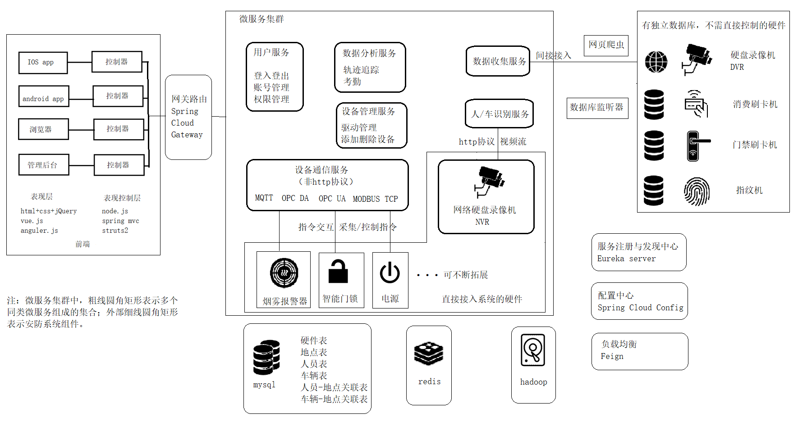

# Campusecurity 校园智能安防系统

本项目为基于分布式微服务框架Spring Cloud的物联网项目。实现设备互联、管理、数据采集、代码生成、快速开发和可视化等。

驱动通信部分使用物联网平台DC3，兼容多种流行的物联网数据接入协议（Mqtt\Socket\Modbus-Tcp\Rtsp\Rtmp\Siemens PLC S7\OpcUa\OpcDa...

## 总体结构

## 接口说明

### 用户服务
#### 登录接口

#### 

### 设备通信服务
#### 获取适配器消息
contextPath:/getInfo
返回 json 对象继承自Adaptor类

#### 