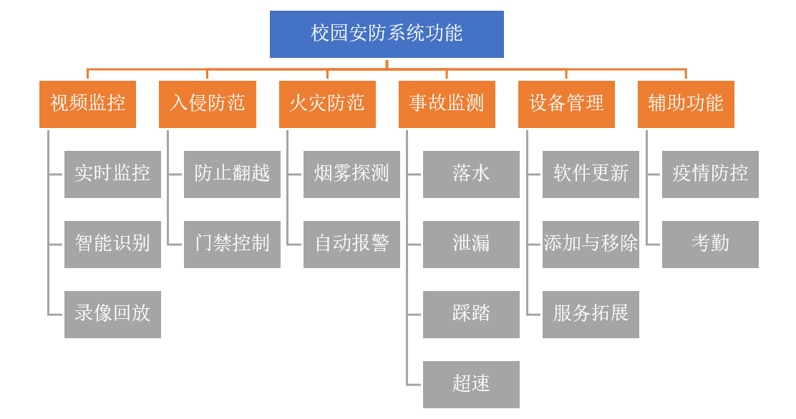
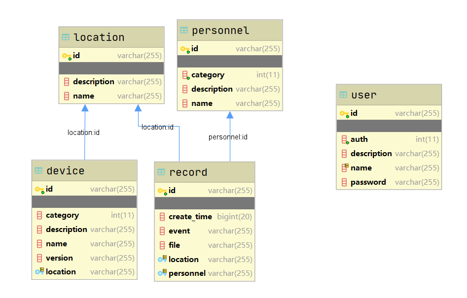

# Campusecurity 校园智能安防系统

本项目为基于分布式微服务框架Spring Cloud的物联网项目。
旨在兼容各种物联网设备的存储与通信标准，实现校园安防系统设备互联、管理、数据采集、热部署、拓展开发等。

## 总体目录结构与模块

图中，各模块所对应的目录以及url如下：

    数据库:
        mysql jdbc:mysql://localhost:3306/campusecurity?serverTimezone=GMT
        redis  localhost:6379
    注册发现中心 eureka  localhost:8761/eureka
    配置中心 configserver localhost:8888
    用户服务 userservice http://localhost:8762 或  lb://userservice
    设备管理服务 devicemanage http://localhost:8763 或 lb://devicemanage
    数据处理服务 facialrecognision http://localhost:8766
    网关兼前端v1（基于模板） geteway http://localhost:8889
    网关v2 （前后端分离）gateway2 http://localhost:8889
        前端 frontend 在开发环境中直接在intellij中打开，url不定
    设备通信服务:
        NVR(摄像头的上位机)适配与通信服务 nvrlistener http://localhost:8764
        烟雾报警器(独立硬件)适配与通信服务 tcpadapter http://localhost:8765
    rtmp流服务器：
        rtmp://localhost:1935/live/home
        http端口 80
        ./ffmpeg.exe -re -i F:\Videos\1.mp4 -vcodec libx264 -acodec aac -f flv rtmp://127.0.0.1:1935/live/home
    http-flv流服务器（linux）:
        推流地址: rtmp://127.0.0.1:9999/myapp/mystream
                rtmp://127.0.0.1:9999/myapp2/mystream
        拉流地址：http://127.0.0.1:8082/live/?port=9999&app=myapp&stream=mystream
    人脸识别消息队列rabbitmq：
        localhost:4369
        监控页面 http://localhost:15672
        sudo service rabbitmq-server start

其他目录：

    feign-api包负责服务集群内部以及前后端通信，包含各种前后端交互接口与服务集群内部接口
    common包中有各种工具类以及通信Dto
    database包中有实体类与spring data jpa接口

## 数据库结构

## 前后端分离方案
为了减少开发成本，前端（gateway包）基于thymeleaf模板与spring mvc，非静态网页，
而且添加了过滤器进行鉴权等操作，不算严格意义上的前后端分离方案，但显然与业务逻辑层隔离，之间使用http协议通信。

## docker问题
创建两个分支，一个是docker容器版本master，一个是非docker的开发环境版本
